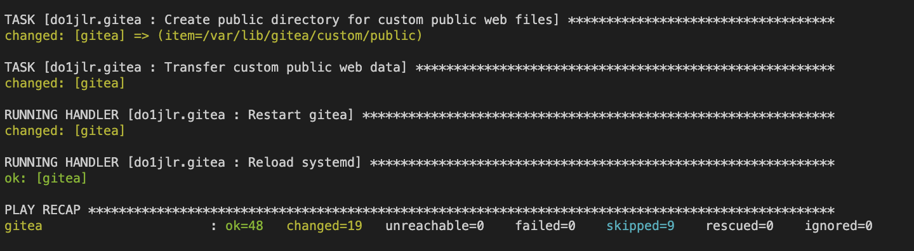

#Description

There is a issue to connect vagrant file.

However, I can prove that the Ansible works well.

This git includes inventory file, requirements file and playbook file.

Throught these files, VMs can automatically establish a website and change the default page.

## test git branch. compare betwenn main and ansible
